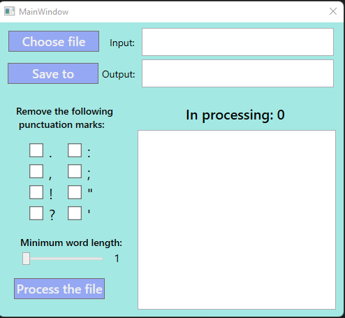

# Обработчик текста
Программа принимает на вход файл на диске. Она позволяет:
- удалять слова длиной меньше определенного числа символов
- удалять знаки препинания

Имеется возможность обработки нескольких файлов и файлов большого объёма.
Результат сохраняется в файл. Входной файл, выходной файл, длину слов и
необходимость удаления знаков препинания задаёт пользователь.

## Технологии
- С#
- WPF

## Использование
Исходный код представлен проектом для Visual Studio. Запустить его можно файлом TextHandler.sln.

На рисунке представлен внешний вид программы.

- Choose file – выбрать входной файл, путь будет отображён в "Input".
- Save to – выбрать выходной файл, путь будет отображён в "Output".
- Remove the following PM – раздел позволяет выбрать какие знаки препинания необходимо удалить.
- Minimum word length – слайдер позволяет установить минимальную длину слов в диапазоне 1-20.
- Process the file – запустить обработку файла.
- In processing – отображает количество обрабатываемых файлов в данный момент. Область ниже отображает информацию о статусе обработки файлов.
## Тестирование
Класс отвечающий за обработку текстового файла покрыт unit-тестами, которые были выполнены с использованием фреймворка NUnit.